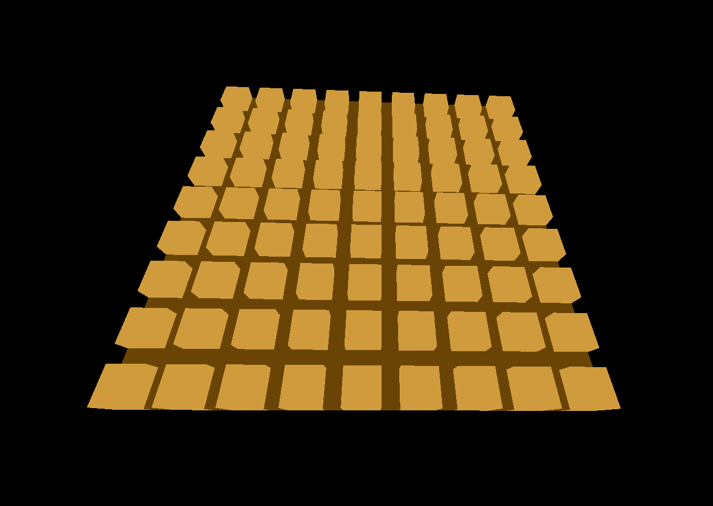

# The Quoridor Board Game

### with [ThreeJs](https://www.threejs.org)

## Setup and run
``` bash
# Download the files
git clone https://github.com/NullVektor1/corridor/

cd corridor

# Run a local server eg. using python
python -m SimpleHTTPServer

Enjoy!

```



